# Corporate Psychology Website

Kurumsal bir psikoloji sitesi için geliştirilmiş tam stack bir web uygulamasıdır. Bu proje **React + Tailwind CSS** ile frontend, **Node.js + Express** ile backend olarak geliştirilmiş olup, kullanıcı ve admin yönetimini **JWT ile authentication** ile sağlamaktadır.  

---

## 🚀 Özellikler

### Admin Panel
- Hizmet ve blog ekleyebilir, güncelleyebilir ve silebilir.
- Randevuları ve kullanıcı mesajlarını listeleyebilir.
- "Hakkımızda" ve "İletişim" bilgilerini güncelleyebilir.
- Şifresini değiştirebilir (update password).

### Kullanıcı Paneli (Frontend)
- Tarih, saat ve hizmet seçerek randevu oluşturabilir.
- Aynı tarih ve saatte başka kullanıcı randevusu oluşturulamaz (çakışma önlenir).
- **Adminin panelden eklediği tüm içerikleri görüntüleyebilir:**
  - Kullanıcılar siteyi ziyaret ettiğinde, admin tarafından eklenen **hizmetler, blog yazıları, kampanyalar, hakkımızda ve iletişim bilgilerini** görebilirler.
  - Kullanıcılar içerikleri **yalnızca görüntüleyebilir**, üzerinde değişiklik yapamazlar.
  - Tüm içerikler **dinamik olarak backend’den çekilir**, yani admin panelindeki güncellemeler otomatik olarak siteye yansır.
  - Blog yazıları ve hizmetler gibi içerikler **kategori** filtresiyle listelenebilir.
  - Bu sayede kullanıcılar her zaman **en güncel bilgiye ve içeriklere** erişebilir.

---

## 🛠️ Teknolojiler
- **Frontend:** React, Tailwind CSS
- **Backend:** Node.js, Express
- **Authentication:** JWT
- **Database:** MongoDB 

---


---

## ⚡ Kurulum

1. Depoyu klonla:
```bash
git clone https://github.com/kullaniciAdi/Corporate-Psychology-Website.git
``` 
2. Backend bağımlılıklarını yükle:
```bash
cd backend
npm install
``` 
3. Frontend bağımlılıklarını yükle:
```bash
cd frontend
npm install
``` 
4. Backend’i çalıştır:
```bash
npm run dev
``` 
5. Frontend’i çalıştır:
```bash
cd frontend
npm run dev
```

### 🖼️ Ekran Görüntüleri

### 🖼️ Ekran Görüntüleri

<table>
  <tr>
    <td>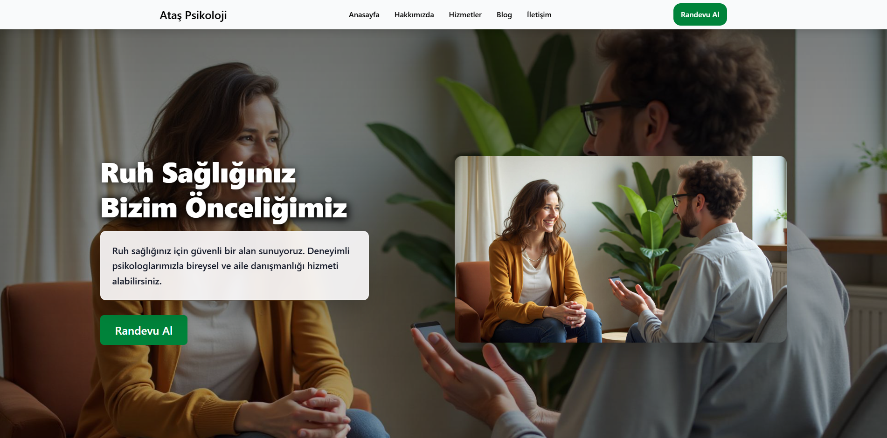</td>
    <td>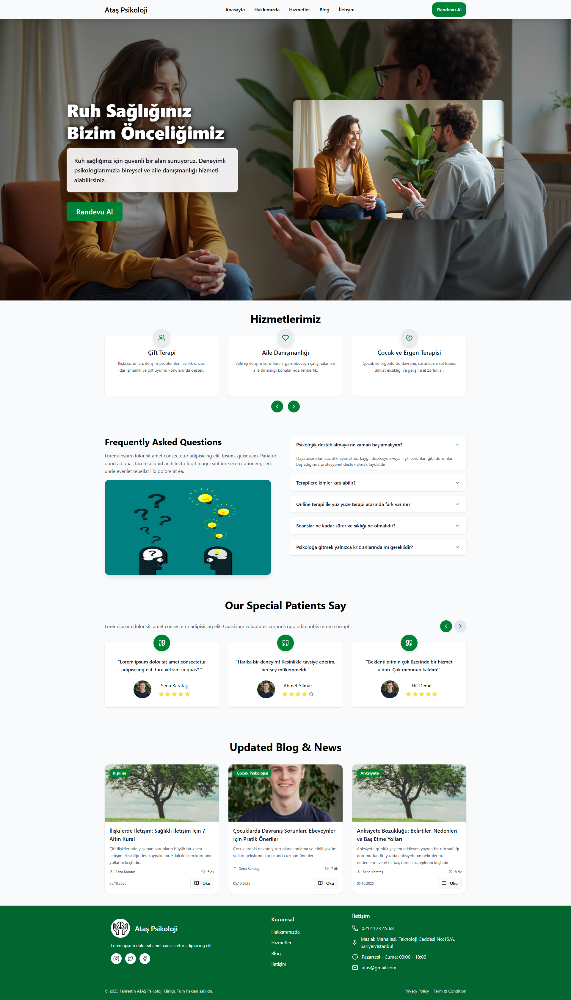</td>
    <td>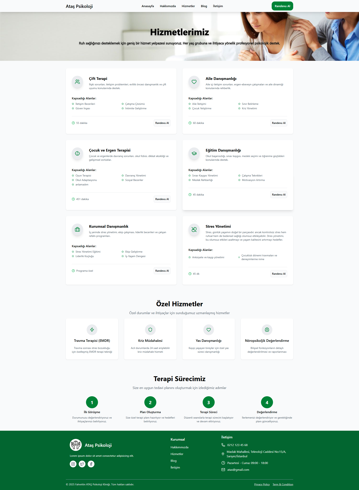</td>
    <td></td>
  </tr>
</table>

<table>
  <tr>
    <td>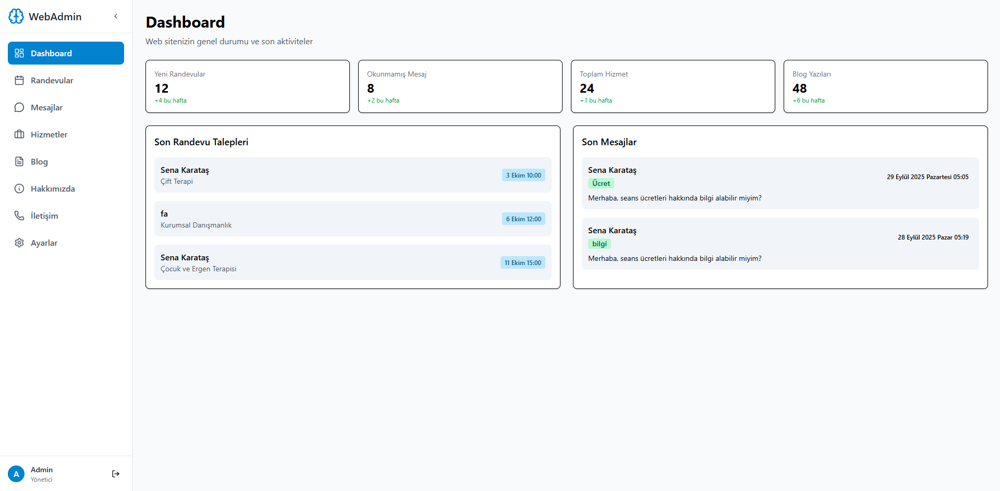</td>
    <td>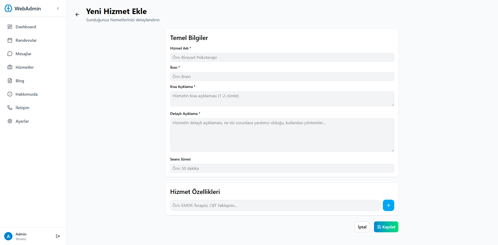</td>
    <td>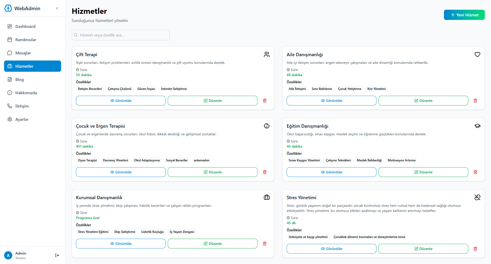</td>
    <td>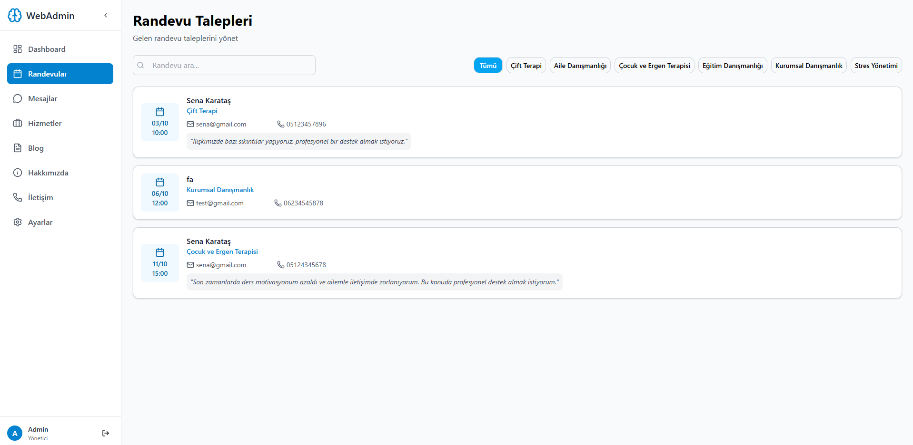</td>
  </tr>
</table>

### 📅 Randevu Oluşturma

<table>
  <tr>
    <td>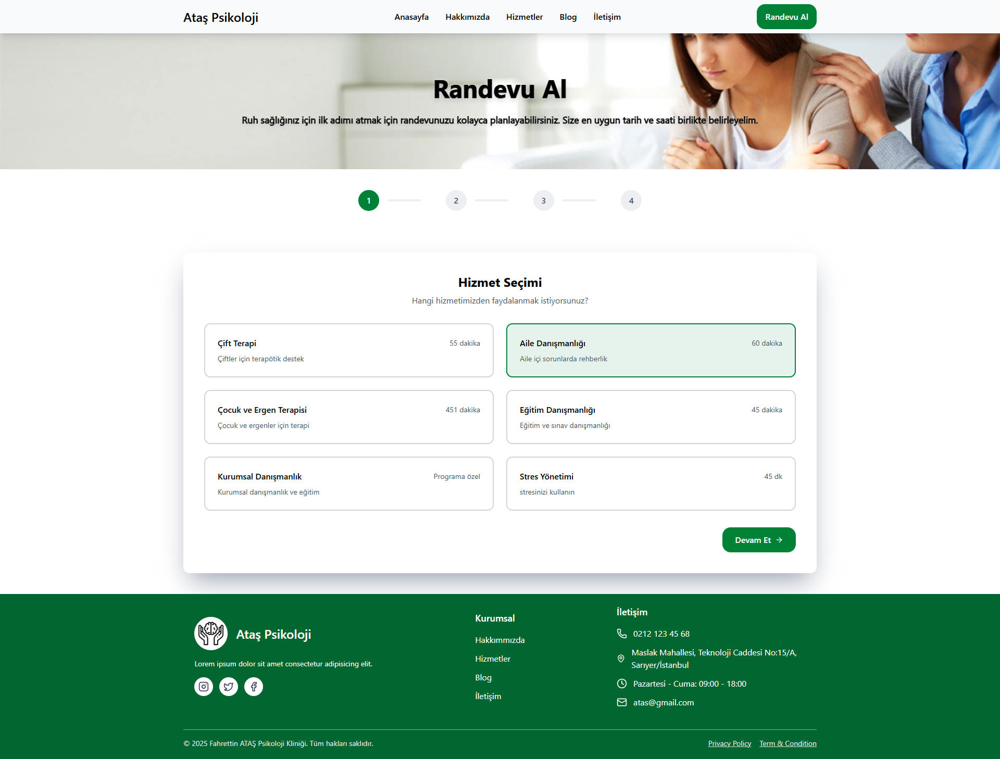</td>
    <td>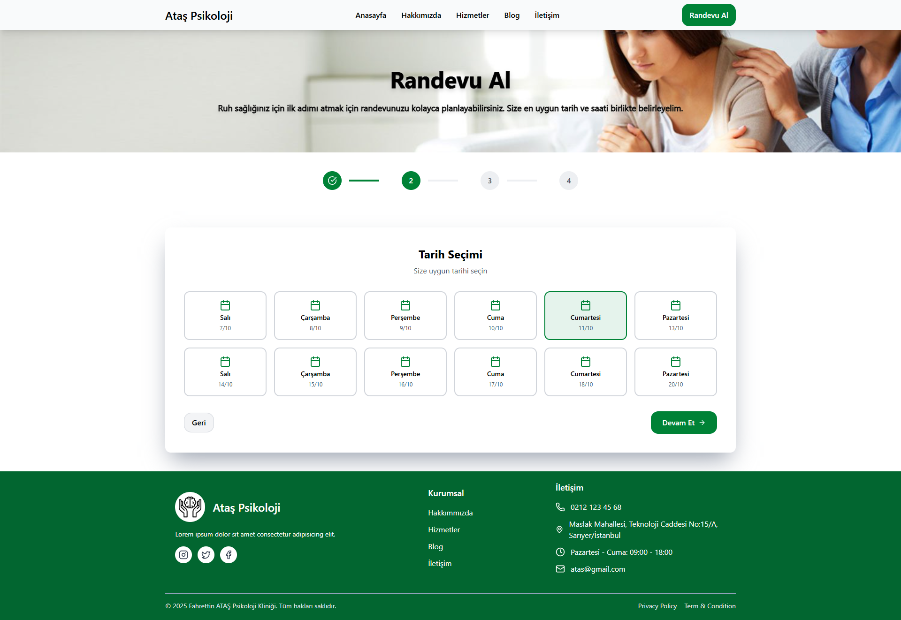</td>
    <td>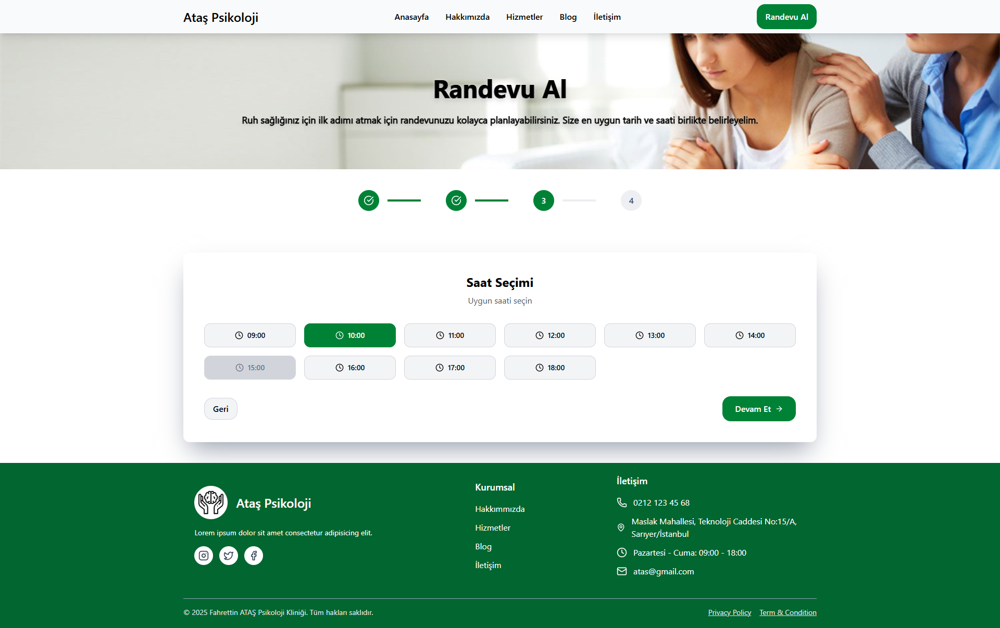</td>
    <td>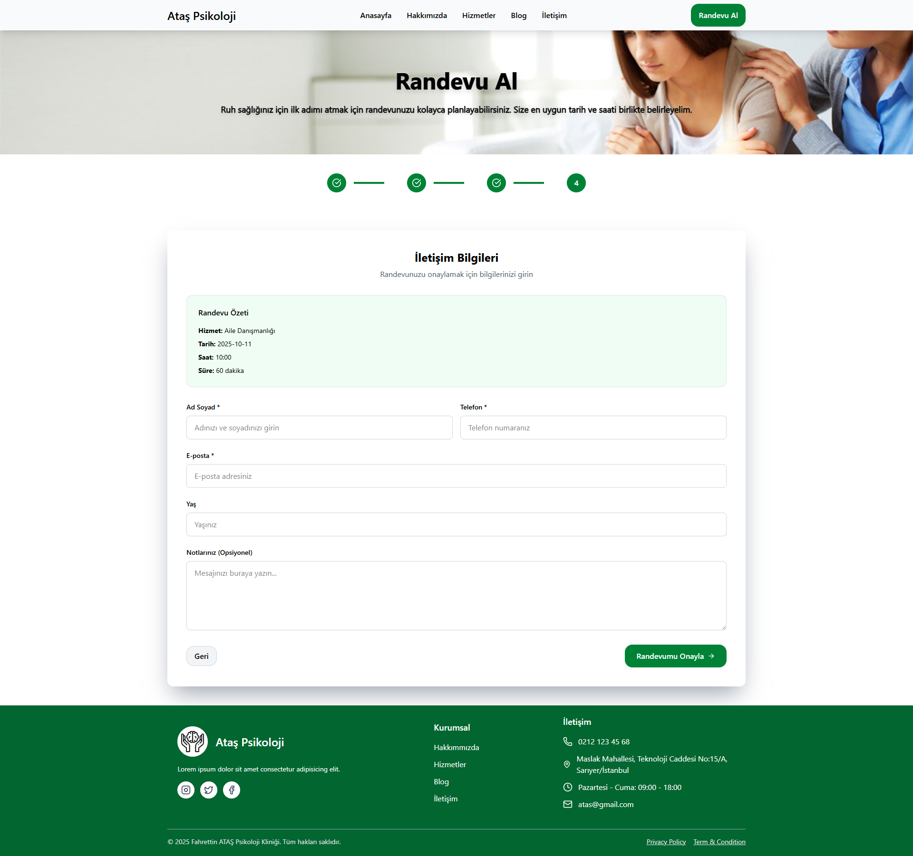</td>
  </tr>
</table>


